# ER‑схема (упрощённо)

Ниже — упрощённая модель основных сущностей. Она помогает понять, как изолируются данные между владельцами (master) и
брендами.

- MasterAccount (владелец)
    - id, name, status
- Brand (бренд)
    - id, name, organizationName, master_id → MasterAccount
- User (пользователь)
    - id, username, email, passwordHash
    - связь многие‑ко‑многим с Brand (через membership)
- UserMembership (членство пользователя)
    - id, user_id → User, master_id → MasterAccount, brand_id → Brand?, pickup_point_id → PickupPoint?
- PickupPoint (локация/пункт выдачи)
    - id, brand_id → Brand
- GroupTag (группы товаров, древовидная структура)
    - id, brand_id → Brand, parent_id → GroupTag?, level, path
- Product (товар)
    - id, brand_id → Brand, group_tag_id → GroupTag?, price, promoPrice, visible
- Order (заказ)
    - id, client_id → User, brand_id → Brand, total, deliveryMode

Все связи построены так, чтобы на каждом уровне был «ключ к владельцу» через master → brand → (groupTag/product/order).

## Расширенная структура БД

- MasterAccount (владелец)
  - id (PK), name, status
  - 1..* Brand
  - 1..* UserMembership (через master_id)

- Brand (бренд)
  - id (PK), name, organizationName, master_id (FK → MasterAccount)
  - 1..* PickupPoint
  - 1..* GroupTag, 1..* Product, 1..* Order
  - M..N User (через UserMembership)

- User (пользователь)
  - id (PK), username, email, passwordHash
  - M..N Brand (через UserMembership)
  - 1..* Order (как client)

- UserMembership (членство пользователя)
  - id (PK)
  - user_id (FK → User)
  - master_id (FK → MasterAccount)
  - brand_id (FK → Brand, nullable)
  - pickup_point_id (FK → PickupPoint, nullable)
  - role (OWNER|ADMIN|CLIENT), status (ACTIVE|INACTIVE), two_factor_enabled
  - Ограничения уникальности: (user_id, brand_id) — уникально в рамках бренда

- UserBrandMembership (лояльность/привязка пользователя к бренду)
  - id (PK), user_id (FK → User), brand_id (FK → Brand)

- PickupPoint (пункт выдачи)
  - id (PK), brand_id (FK → Brand), name, address, active

- GroupTag (иерархия групп товаров)
  - id (PK), brand_id (FK → Brand)
  - parent_id (FK → GroupTag, nullable), level, path
  - Опционально связь с Product (через group_tag_id)

- Product (товар)
  - id (PK), brand_id (FK → Brand)
  - group_tag_id (FK → GroupTag, nullable)
  - name, description, price, promoPrice, visible

- Order (заказ)
  - id (PK), client_id (FK → User), brand_id (FK → Brand)
  - total, deliveryMode, status

## ER‑диаграмма (Mermaid)

```mermaid
erDiagram
    %% ===== Relations (high-level) =====
    master_account ||--o{ brands : owns
    master_account ||--o{ user_membership : context

    brands ||--o{ pickup_points : has
    brands ||--o{ group_tags : categorizes
    brands ||--o{ products : offers
    brands ||--o{ orders : receives
    brands ||--o{ user_membership : membership
    brands ||--o{ user_brand_membership : loyalty
    brands ||--o{ product_archive : archived
    brands ||--o{ group_tag_archive : archived

    %% ===== Inventory (new) =====
    master_account ||--o{ warehouses : owns
    warehouses ||--o{ stock : holds
    master_account ||--o{ units : measures
    master_account ||--o{ ingredients : has
    master_account ||--o{ packagings : packs
    master_account ||--o{ supplies : receives
    supplies ||--o{ supply_items : contains
    ingredients ||--o{ stock : aggregated

    users ||--o{ user_membership : has
    users ||--o{ orders : places
    users ||--o{ user_brand_membership : linked
    users ||--o{ tokens : tokens
    users ||--o{ user_providers : providers
    users ||--o{ cart_items : cart

    group_tags ||--o{ group_tags : parent
    group_tags ||--o{ products : groups
    orders ||--o{ order_items : contains
    orders ||--o{ order_messages : messages
    user_brand_membership ||--o{ delivery_addresses : addresses

    %% ===== Entities with fields =====
    master_account {
        bigint id PK
        varchar name
        varchar status
        timestamp created_at
        timestamp updated_at
    }

    warehouses {
        bigint id PK
        varchar name
        bigint master_id FK
    }

    units {
        bigint id PK
        varchar name
        varchar short_name
        bigint master_id FK
    }

    ingredients {
        bigint id PK
        varchar name
        bigint unit_id FK
        bigint master_id FK
        decimal package_size
        varchar notes
    }

    packagings {
        bigint id PK
        bigint master_id FK
        varchar name
        bigint unit_id FK
        decimal size
    }

    supplies {
        bigint id PK
        bigint master_id FK
        bigint warehouse_id FK
        bigint supplier_id
        timestamp date
        varchar notes
        varchar status
    }

    supply_items {
        bigint id PK
        bigint supply_id FK
        bigint ingredient_id FK
        decimal qty
        date expires_at
    }

    stock {
        bigint id PK
        bigint master_id FK
        bigint warehouse_id FK
        bigint ingredient_id FK
        decimal quantity
        date earliest_expiry
        timestamp last_supply_date
    }

    brands {
        bigint id PK
        varchar name
        varchar organization_name
        bigint master_id FK
        varchar telegram_bot_token
    }

    users {
        int id PK
        string username
        string password_hash
        string first_name
        string last_name
        string patronymic
        date date_of_birth
        string email
        string phone
        string avatar_url
        boolean email_verified
        string email_verification_code
        date email_verification_expires_at
        string pending_email
        int master_id
        int department_id FK
        date created_at
        date updated_at
    }

    roles {
        int id PK
        string name
    }

    user_roles {
        int user_id FK
        int role_id FK
    }

    user_brand {
        int user_id FK
        int brand_id FK
    }

    departments {
        int id PK
        string name
        string description
    }

    storage_files {
        int id PK
        string path
        string purpose
        string usage_type
        string owner_type
        int owner_id
        date created_at
        date updated_at
    }

    tokens {
        int id PK
        string token
        string token_type
        boolean revoked
        date expiry_date
        int user_id FK
    }

    user_providers {
        int id PK
        int user_id FK
        string provider
        string provider_user_id
        date created_at
    }

    cart_items {
        int id PK
        int user_id FK
        string cart_token
        int brand_id FK
        int product_id FK
        int quantity
        date created_at
        date updated_at
    }

    pickup_points {
        int id PK
        int brand_id FK
        string name
        string address
        float latitude
        float longitude
        boolean active
    }

    group_tags {
        int id PK
        string name
        int brand_id FK
        int parent_id FK
        string path
        int level
    }

    group_tag_archive {
        int id PK
        int original_group_tag_id
        int brand_id
        int parent_id
        string name
        string path
        int level
        date archived_at
    }

    products {
        int id PK
        string name
        string description
        float price
        float promo_price
        int brand_id FK
        int master_id FK
        int group_tag_id FK
        boolean visible
        int anonymous_cart_interest
        int auth_cart_interest
        date created_at
        date updated_at
    }

    product_archive {
        int id PK
        int original_product_id
        string name
        string description
        float price
        float promo_price
        int brand_id
        int group_tag_id
        string group_path
        boolean visible
        date archived_at
        date created_at
        date updated_at
    }

    orders {
        int id PK
        int client_id FK
        int brand_id FK
        int master_id FK
        float total
        date created_at
        date updated_at
        string status
        string delivery_mode
        string address_snapshot
        string pickup_snapshot
        string comment
    }

    order_items {
        int id PK
        int order_id FK
        int product_id FK
        int quantity
        float price
    }

    order_messages {
        int id PK
        int order_id FK
        boolean from_client
        string text
        int sender_user_id
        date created_at
    }

    order_review {
        int id PK
        int order_id FK
        int client_id FK
        int rating
        string comment
        date created_at
    }

    user_membership {
        int id PK
        int user_id FK
        int master_id FK
        int brand_id FK
        int pickup_point_id FK
        string role
        string status
        boolean two_factor_enabled
        date created_at
        date updated_at
    }

    user_brand_membership {
        int id PK
        int user_id FK
        int brand_id FK
        float bonus_balance
        string tier
        date created_at
        date updated_at
    }

    delivery_addresses {
        int id PK
        int membership_id FK
        string line1
        string line2
        string city
        string region
        string postcode
        string comment
        boolean deleted
        date created_at
        date updated_at
    }

    %% ===== Join table relations =====
    users ||--o{ user_roles : has
    roles ||--o{ user_roles : assigned
    users ||--o{ user_brand : brands
    brands ||--o{ user_brand : users
```

## Примечания

- Для защищённых операций требуется заголовок `X-Master-Id` (контекст мастера).
- Уникальность `(user_id, brand_id)` обеспечивает отсутствие дубликатов членства в бренде.
- Публичные операции (меню) не требуют контекста и работают по `brand_id` напрямую.

### Примечания по инвентарю

- `stock` хранит агрегированные остатки по `(master, warehouse, ingredient)`.
- `earliest_expiry` — минимальная дата годности из последних партий; `last_supply_date` — дата последней проведённой
  поставки.
- Проведение поставки (`supplies.status = POSTED`) увеличивает `stock.quantity` на сумму позиций.
